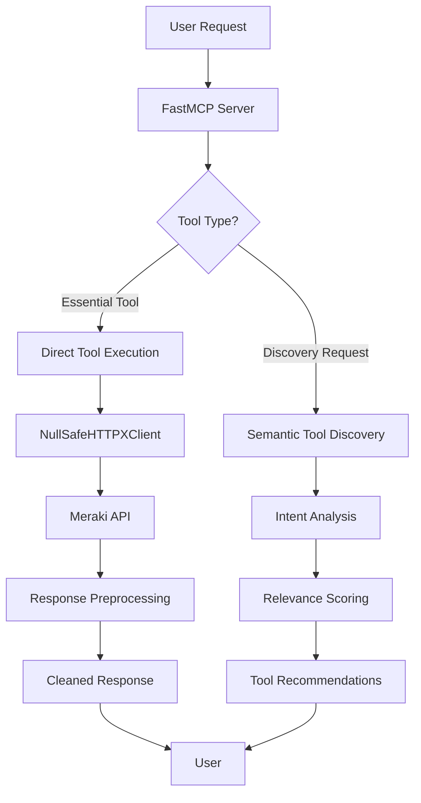

# Fast Meraki MCP Server Architecture

## Overview

The Fast Meraki MCP Server implements a sophisticated **three-layer architecture** that combines semantic tool discovery with null-safe API processing to provide intelligent access to Cisco Meraki APIs through the Model Context Protocol (MCP).

## Architecture Layers

### 1. API Layer - Null-Safe HTTP Client
**Class**: `NullSafeHTTPXClient`
**Responsibility**: Handle communication with Meraki API with preprocessing

```python
class NullSafeHTTPXClient(httpx.AsyncClient):
    """
    FastMCP-compliant HTTPX client that preprocesses responses to handle null values
    before they reach FastMCP's schema validation.
    """
```

**Key Features**:
- **Null Value Preprocessing**: Automatically converts `null` values to empty strings
- **Recursive Cleaning**: Handles nested objects and arrays containing null values
- **Transparent Integration**: Works seamlessly with existing Meraki API responses
- **Error Handling**: Gracefully handles JSON parsing errors and API failures

**Problem Solved**: Prevents FastMCP validation errors when Meraki API returns null values for string fields, especially common with empty organizations or networks.

### 2. Processing Layer - Semantic Tool Discovery
**Class**: `SemanticToolDiscovery`
**Responsibility**: AI-powered intelligent tool selection and conversation analysis

```python
class SemanticToolDiscovery:
    """
    Intelligent tool discovery system that analyzes OpenAPI specs and conversation context
    to dynamically load relevant tools without overwhelming the LLM.
    """
```

**Core Intelligence**:
- **Semantic Analysis**: Analyzes OpenAPI specifications to build semantic profiles for each endpoint
- **Intent Understanding**: Parses user requests to extract semantic meaning and keywords
- **Relevance Scoring**: Scores tools based on intent match, priority, and complexity
- **Context Learning**: Maintains conversation context to improve suggestions over time
- **Smart Filtering**: Prevents "tool overwhelm" by limiting results to most relevant tools

**Semantic Profile Components**:
- **Keywords**: Extracted from endpoint paths, descriptions, and operation IDs
- **Use Cases**: Generated based on endpoint analysis (e.g., "Monitor network health", "Troubleshoot connectivity")
- **Priority**: Calculated based on common usage patterns (1-10 scale)
- **Complexity**: Determined by required parameters and operation type (1-10 scale)
- **Categories**: Functional groupings (organization, network, device, wireless, etc.)

### 3. MCP Layer - FastMCP Server Integration
**Framework**: FastMCP 2.10.6 with OpenAPI integration
**Responsibility**: MCP protocol handling and tool/resource management

**Components**:
- **Essential Tools**: 9 core Meraki endpoints always available
- **Discovery Tools**: 3 meta-tools for intelligent tool discovery
- **Health Endpoints**: Status monitoring and tool information
- **Route Mapping**: Semantic categorization of API endpoints

## Essential Tools (Always Available)

The server registers 9 essential Meraki tools that provide core network management functionality:

| Tool Name | Endpoint | Description |
|-----------|----------|-------------|
| `mcp_meraki_listOrganizations` | `GET /organizations` | List all organizations |
| `mcp_meraki_getOrganization` | `GET /organizations/{organizationId}` | Get organization details |
| `mcp_meraki_listOrgNetworks` | `GET /organizations/{organizationId}/networks` | List networks in organization |
| `mcp_meraki_getNetwork` | `GET /networks/{networkId}` | Get network details |
| `mcp_meraki_listOrgDevices` | `GET /organizations/{organizationId}/devices` | List devices in organization |
| `mcp_meraki_listNetworkDevices` | `GET /networks/{networkId}/devices` | List devices in network |
| `mcp_meraki_getDevice` | `GET /devices/{serial}` | Get device details |
| `mcp_meraki_listNetworkClients` | `GET /networks/{networkId}/clients` | List clients in network |
| `mcp_meraki_listOrgInventoryDevices` | `GET /organizations/{organizationId}/inventory/devices` | List inventory devices |

## Discovery & Meta Tools

The server provides 3 intelligent meta-tools for enhanced user experience:

### 1. `discoverRelevantTools`
- **Purpose**: AI-powered tool discovery based on user intent
- **Input**: User intent description (e.g., "monitor network performance")
- **Output**: Ranked list of relevant tools with use cases
- **Intelligence**: Semantic analysis of intent vs. tool capabilities

### 2. `analyzeConversationContext`
- **Purpose**: Analyze conversation for better tool suggestions
- **Input**: Conversation history analysis
- **Output**: Context-aware insights and tool recommendations
- **Intelligence**: Pattern recognition and context understanding

### 3. `explainSemanticDiscovery`
- **Purpose**: Explain how the discovery system works
- **Output**: Detailed explanation of the semantic analysis architecture
- **Use Case**: Help users understand the system's capabilities

## Data Flow



## Key Design Decisions

### 1. Three-Layer Separation
- **Benefit**: Clear separation of concerns
- **Maintainability**: Each layer can be updated independently
- **Testing**: Layers can be tested in isolation

### 2. Null-Safe Preprocessing
- **Problem**: Meraki API returns null values that break FastMCP validation
- **Solution**: Preprocess responses before validation
- **Benefit**: Zero breaking changes to existing API

### 3. Semantic Discovery
- **Problem**: Meraki API has 500+ endpoints, overwhelming for LLMs
- **Solution**: AI-powered relevance filtering
- **Benefit**: Users get exactly the tools they need

### 4. Essential Tool Registration
- **Problem**: Previous implementation only "discovered" but never registered tools
- **Solution**: Explicitly register 9 core tools as callable MCP tools
- **Benefit**: Tools are both discoverable AND usable

## Configuration

### Environment Variables
```bash
MERAKI_API_KEY=your_api_key_here    # Required
MCP_SERVER_PORT=8000                # Optional, default: 8000
MCP_SERVER_HOST=0.0.0.0            # Optional, default: 0.0.0.0
LOG_LEVEL=INFO                      # Optional, default: INFO
```

### Dependencies
- **FastMCP**: 2.10.6+ (core MCP framework)
- **HTTPX**: 0.28.1+ (async HTTP client)
- **Python**: 3.12+ (recommended for best performance)

## Health & Monitoring

### Health Check Endpoint
```bash
curl http://localhost:8000/health
```

**Response**:
```json
{
  "status": "healthy",
  "null_safe_processing": "active",
  "fastmcp_compliance": "100%",
  "filtering_method": "FastMCP route mapping with null-safe HTTPX client"
}
```

### Tool Information Endpoint
```bash
curl http://localhost:8000/tools/info
```

Provides statistics about available tools and server status.

## Performance Characteristics

- **Startup Time**: ~2-3 seconds (OpenAPI spec analysis)
- **Tool Discovery**: ~100-200ms (semantic analysis)
- **API Calls**: ~500-1000ms (depends on Meraki API response time)
- **Memory Usage**: ~50-100MB (OpenAPI spec caching)

## Security Considerations

- **API Key Protection**: Never logs or exposes API keys
- **Input Validation**: All tool parameters validated before API calls
- **Error Handling**: Comprehensive error handling prevents information leakage
- **Rate Limiting**: Respects Meraki API rate limits (documented in tool descriptions)

## Extensibility

The architecture supports easy extension:

1. **New Tools**: Add to essential tools list or let semantic discovery handle them
2. **Custom Preprocessing**: Extend `NullSafeHTTPXClient` for additional API quirks
3. **Enhanced Intelligence**: Improve semantic analysis algorithms
4. **Additional Endpoints**: Health and tool info endpoints can be extended

This architecture provides a robust, intelligent, and maintainable foundation for Meraki network management through MCP. 